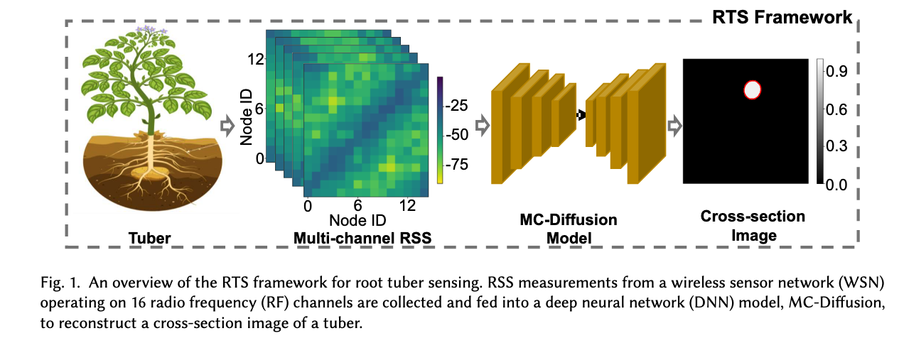

# RTS
We introduce RTS, a novel framework for underground tuber sensing, capable of imaging the cross-sections for underground tubers, including sizes, shapes, and positions, using a 
novel MC-Diffusion model and multi-channel received signal strength data. 

