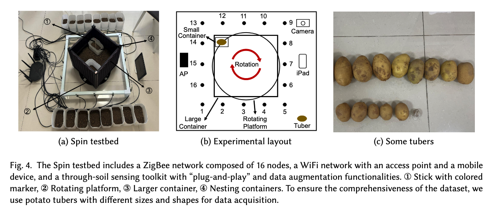
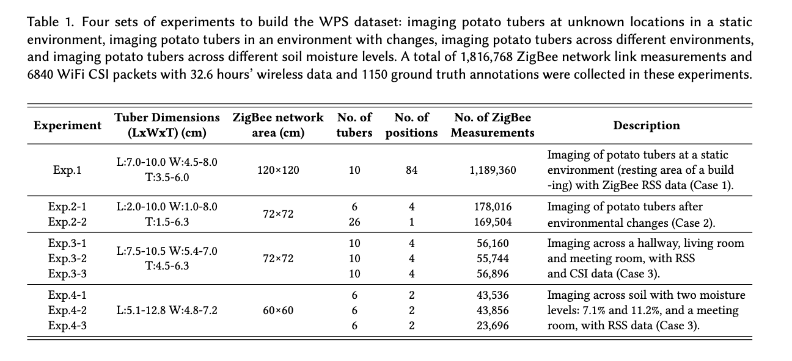
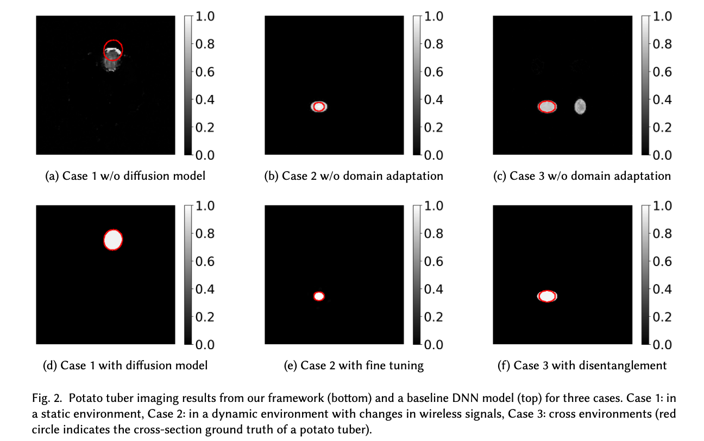
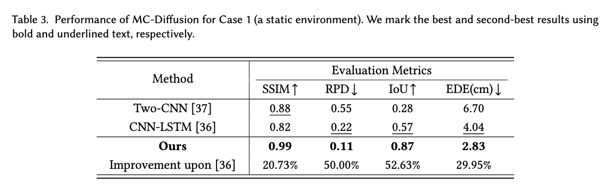
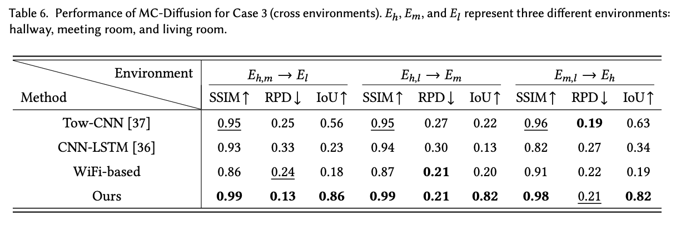

# RTS
We introduce RTS, a novel framework for underground tuber sensing, capable of imaging the cross-sections of underground tubers, including sizes, shapes, and positions, using a 
novel MC-Diffusion model and multi-channel received signal strength data. We extensively evaluate the imaging capabilities of the RTS and validate its effectiveness across multiple scenarios, including tuber imaging in a static environment, robust imaging under environmental changes, and cross-environment and cross-soil imaging for underground tubers. 


For data collection, we design a testbed named Spin, which includes various containers and a rotating platform.


To evaluate the performance of the RTS framework, we construct a comprehensive dataset consisting of data from a static environment (Case 1), a fixed environment with dynamic changes (Case 2), and various environments with diverse soil conditions (Case 3). 


We have released the pre-trained model and part of the corresponding data files in releases, which can be used for performance testing. 

## 1. Visualization Results
Some visualization results of the RTS framework and baseline methods are shown below. For demonstration purposes, we present imaging results from a static environment, a fixed environment with dynamic changes, and across different environments. 

As shown, the RTS framework generates images that accurately demonstrate sizes, shapes, and positions. 

## 2. Evaluation in a static environment
We use four different metrics to quantitatively evaluate the performance of the RTS framework in a static environment, as well as that of baseline methods.

As shown, our method demonstrates significant improvements over baseline methods.

## 3. Evaluation for cross-environment imaging
We use different metrics to quantitatively evaluate the performance of the RTS framework for cross-environment imaging. The results of our model and the baseline methods are shown below.



# Prerequisite and Evaluation
## 2.1. Prerequisite
RTS is implemented with Python 3.10 and PyTorch 2.1.0. We manage the development environment using Conda. Execute the following commands to configure the development environment.
* Create a conda environment called RTS based on python 3.10, and activate the environment.
```
conda create -n RTS python=3.10
conda activate RTS 
```
Install PyTorch, as well as other required packages, 
```
  pip3 install torch
  pip3 install scikit-learn==1.0.2
  pip3 install scikit-image==0.19.2
```


